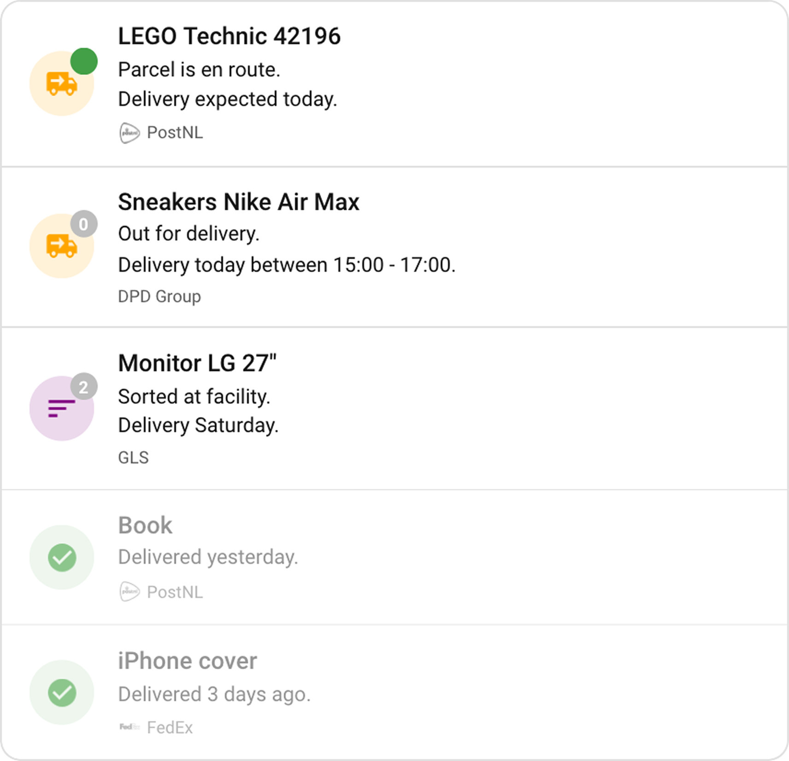

# Package Tracker Card

> [!NOTE]
> This card is vibe coded

A Home Assistant Lovelace card that shows your packages in a clean, unified view.

---

## Installation

1. Go to **HACS** → three-dot menu → **Custom repositories**.
2. Enter `https://github.com/klaptafel/ha-package-tracker-card`, category **Dashboard**, click **Add**.
3. Find **Package Tracker Card** and click **Download**.

---

## Configuration

The visual editor covers everything. Sources are auto-detected — open the editor and click **+** next to an integration to add it.

### Supported integrations

- [PostNL](https://github.com/michaelarnauts/ha-postnl) integration
- [Parcel](https://github.com/jmdevita/parcel-ha) integration

Brand icons are optional: [custom-brand-icons](https://github.com/elax46/custom-brand-icons)

### Options

| Option | Default | Description |
|---|---|---|
| `sources` | required | List of sources. Each has `type` and `entity`. |
| `layout` | `single` | `single` or `split`. |
| `max` | `5` | Maximum packages to  show.|

#### Filter

| Option | Default | Description |
|---|---|---|
| `state` | `all` | `all`, `enroute`, or `delivered`. |
| `direction` | — | `incoming` or `outgoing`. |
| `slot_active` | `false` | Active delivery window only. |
| `carrier` | — | Filter by carrier code, e.g. `dpdgroup`. [All codes](https://parcel.app/supported-carriers). |
| `date` | — | Relative day. `0` = today, `1` = tomorrow, `-1` = yesterday. |

#### Show

| Option | Default | Description |
|---|---|---|
| `status` | `true` | Status line. |
| `carrier` | `true` | Carrier name. |
| `brand_icon` | `true` | Carrier logo (requires custom-brand-icons). |
| `badge` | `true` | Days until delivery on the icon. |
| `location` | `false` | Last known location. |
| `dim_delivered` | `true` | Delivered packages at reduced opacity. |
| `hide_when_empty` | `false` | Hide the card when there are no packages. |
