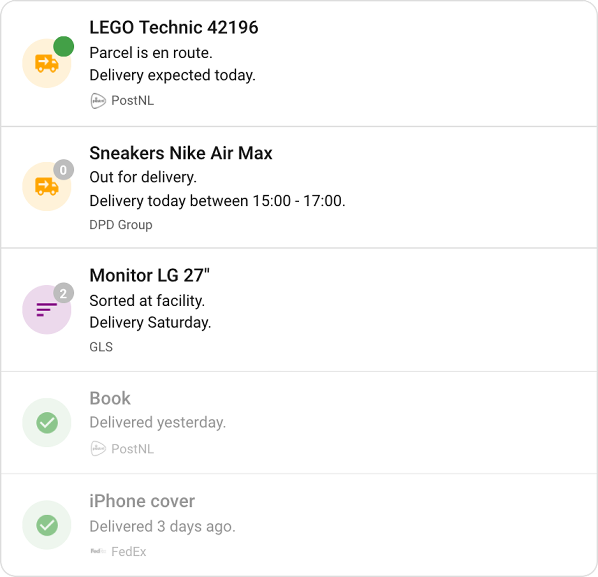

# Package Tracker Card

> [!NOTE]
> This card is vibe coded

A Home Assistant Lovelace card that shows your packages from multiple carrier integrations in one clean, unified view.

---

## Features

- **One card, multiple sources**: combine integrations from multiple carriers side by side, deduplicated automatically when the same parcel shows up through more than one source.
- **Expandable detail per package**: tracking code (tap to copy), full event timeline, and package size/weight when the carrier provides it.
- **Auto-detecting editor**: open the editor, click **+** next to a detected integration, done. Multiple accounts of the same integration are detected and managed separately. No YAML required for normal use.
- **Filter & layout options**: filter by carrier, status, direction, or delivery window; single combined card or split incoming/outgoing cards.

---

## Installation

1. Go to **HACS** → three-dot menu → **Custom repositories**.
2. Enter `https://github.com/klaptafel/ha-package-tracker-card`, category **Dashboard**, click **Add**.
3. Find **Package Tracker Card** and click **Download**.

---

## Configuration

The visual editor covers everything, organized the same way as the editor itself: **Sources**, **Filter**, **Appearance**.

### Sources

Auto-detected: open the editor's **Sources** tab and click **+** next to a detected integration to add it. Integrations you don't have installed show a download icon instead, linking straight to the repository. If you have multiple accounts of the same integration, each shows up as its own entry, addable/removable independently.

PostNL, DHL NL, and DPD each cover that one specific carrier. Parcel covers several carriers generically.

- [arjenbos/ha-postnl](https://github.com/arjenbos/ha-postnl)
- [peternijssen/ha-postnl](https://github.com/peternijssen/ha-postnl), a fork of the above; shares the same Home Assistant domain, so only one of the two can be installed at a time, detected automatically. Also adds scanned mail (letters) as a bonus, shown alongside your packages. **Requires 4.0.0 or newer**: older versions use a different data shape this card doesn't recognize. 4.2.0+ adds an optional per-parcel event history (off by default, enable it in the integration's options).
- [peternijssen/ha-dhl-nl](https://github.com/peternijssen/ha-dhl-nl): 2.0.0 (stable) or newer recommended. 2.3.0+ adds an optional per-parcel event history (off by default, enable it in the integration's options).
- [peternijssen/ha-dpd](https://github.com/peternijssen/ha-dpd): 2.0.0 (stable) or newer recommended. 2.3.0+ adds an optional per-parcel event history (off by default, enable it in the integration's options).
- [jmdevita/parcel-ha](https://github.com/jmdevita/parcel-ha): a third-party aggregator. Works well on its own, or alongside a carrier's own integration above; the card merges event timelines per-moment rather than picking one source, so nothing is lost.

| Option    | Default  | Description                                    |
| --------- | -------- | ---------------------------------------------- |
| `sources` | required | List of sources. Each has `type` and `entity`. |

### Filter

| Option        | Default | Description                                                                                  |
| ------------- | ------- | ---------------------------------------------------------------------------------------------- |
| `state`       | `all`   | `all`, `enroute`, or `delivered`.                                                               |
| `direction`   | -       | `incoming` or `outgoing`.                                                                      |
| `carriers`    | -       | Filter by one or more carrier codes, e.g. `[dpdgpcode]`. The editor offers these as a dropdown populated from your own sources; easier than looking codes up. The older singular `carrier` (string) still works for existing configs. |
| `slot_active` | `false` | Active delivery window only.                                                                   |
| `date`        | -       | Relative day. `0` = today, `1` = tomorrow, `-1` = yesterday.                                    |

### Appearance

**Layout**

| Option    | Default  | Description                                    |
| --------- | -------- | ---------------------------------------------- |
| `layout`  | `single` | `single` or `split`.                           |
| `max`     | `5`      | Maximum packages to show.                      |

**Show**

| Option            | Default | Description                                                                                   |
| ----------------- | ------- | ----------------------------------------------------------------------------------------------- |
| `status`          | `true`  | Status line.                                                                                     |
| `carrier`         | `true`  | Carrier name.                                                                                    |
| `brand_icon`      | `true`  | Carrier logo. Requires [custom-brand-icons](https://github.com/elax46/custom-brand-icons).        |
| `details`         | `true`  | Expandable chevron with extra info per package: event timeline, tracking code, package size, or letter scan. |
| `badge`           | `true`  | Days until delivery on the icon.                                                                 |
| `location`        | `false` | Last known location.                                                                              |

**Behaviour**

| Option            | Default | Description                                |
| ----------------- | ------- | ------------------------------------------- |
| `dim_delivered`   | `true`  | Delivered packages at reduced opacity.      |
| `hide_when_empty` | `false` | Hide the card when there are no packages.   |
